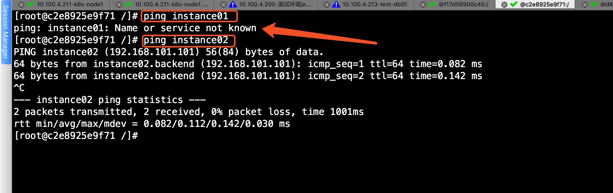

# Docker 基本指令
### 1、attach

- 功能：attach to a running container（连接到一个运行的容器）

- 使用格式

```bash
Usage:  docker attach [OPTIONS] CONTAINER
```
- 示例


在使用-d参数时，容器启动后会进入后台。 某些时候需要进入容器进行操作，有很多种方法，包括使用 docker attach 命令或 docker exec 等。

```bash
root@docker-node1-4-197:~ # docker run -it --name centos --rm 10.100.4.214:1180/centos/centos:7.4.1708v1
[root@3c463f1c14eb /]# 
# 按 Ctrl+p 松开 按 Ctrl+q 退出当前容器内终端

root@docker-node1-4-197:~ # docker attach centos
[root@3c463f1c14eb /]# 
```
**注意：** 在使用 attach 进入容器时如果执行了 exit 命令那么当前容器就会被停止。

### 2、exec
- 功能：Run a command in a running container (在运行的容器中运行一个命令)。
- 使用格式


```bash
Usage:  docker exec -it CONTAINER COMMAND [ARG...]
```
- 示例


```bash
root@docker-node1-4-197:~ # docker run -d --name centos 10.100.4.214:1180/centos/centos:7.4.1708v1 sleep 3000
ab54fb1ea70e26fc47200d50a0c6036184f6e25fb76717630a38059b02700eb2
root@docker-node1-4-197:~ # docker exec -it centos bash
[root@ab54fb1ea70e /]# exit
exit

# 执行 exit 命令后容器还在运行并不会像 attach 一样终止容器
root@docker-node1-4-197:~ # docker ps 
CONTAINER ID        IMAGE                                        COMMAND             CREATED             STATUS              PORTS               NAMES
ab54fb1ea70e        10.100.4.214:1180/centos/centos:7.4.1708v1   "sleep 3000"        19 seconds ago      Up 17 seconds                           centos
```
### 3、build

- 功能：Build a new image from the source code at PATH （在指定的路径中从源代码构建一个新的镜像）。

- 使用格式


```bash
Usage:  docker build -t name:tag PATH | URL 
```
- 示例1

使用GitHub中的 Dockerfile 直接构建镜像

```bash
root@docker-node1-4-197:~ # docker images
REPOSITORY                        TAG                 IMAGE ID            CREATED             SIZE
10.100.4.214:1180/jdk/jdk         1.8.0v1             34d36992bfd5        6 weeks ago         588MB
10.100.4.214:1180/centos/centos   7.4.1708v1          1865e557aac5        6 weeks ago         218MB
root@docker-node1-4-197:~ # docker build -t wangenzhi/tomcat:v1 https://github.com/wangenzhi/Dockerfile-Tomcat.git
Sending build context to Docker daemon  18.88MB
Step 1/13 : FROM 10.100.4.214:1180/jdk/jdk:1.8.0v1
 ---> 34d36992bfd5
Step 2/13 : MAINTAINER "wangenzhi <W_enzhi@163.com>"
 ---> Running in 0fb1a5c7be49
Removing intermediate container 0fb1a5c7be49
 ---> 69e17cc5de8d
Step 3/13 : ENV CATALINA_HOME="/usr/local/tomcat/"
 ---> Running in e9be8d0883d0
Removing intermediate container e9be8d0883d0
 ---> 0bcb22655ef7
Step 4/13 : ENV PATH=${CATALINA_HOME}/bin:${PATH}
 ---> Running in b9658832315f
Removing intermediate container b9658832315f
 ---> 236953fcc7ba
Step 5/13 : RUN mkdir -p /data/{logs,backup/tomcat} && echo "Asia/shanghai" > /etc/timezone && cp /usr/share/zoneinfo/Asia/Shanghai /etc/localtime
 ---> Running in b4630ac5e88c
Removing intermediate container b4630ac5e88c
 ---> 13cff0b9ba81
Step 6/13 : ADD apache-tomcat-8.5.15.tar.gz /usr/local/
 ---> b703ed911606
Step 7/13 : COPY catalina.sh /usr/local/apache-tomcat-8.5.15/bin/
 ---> 1508b15de0f6
Step 8/13 : COPY server.xml /usr/local/apache-tomcat-8.5.15/conf/
 ---> 98acb92c95e6
Step 9/13 : RUN chmod +x /usr/local/apache-tomcat-8.5.15/bin/catalina.sh && ln -sv /usr/local/apache-tomcat-8.5.15/ /usr/local/tomcat && ln -sv /usr/local/tomcat/ /data/backup/tomcat/lastversion && ln -sv /usr/local/tomcat/logs/ /data/logs/tomcat && rm -fr /usr/local/apache-tomcat-8.5.15/webapps/*
 ---> Running in 27fdfc2721ca
'/usr/local/tomcat' -> '/usr/local/apache-tomcat-8.5.15/'
'/data/backup/tomcat/lastversion' -> '/usr/local/tomcat/'
'/data/logs/tomcat' -> '/usr/local/tomcat/logs/'
Removing intermediate container 27fdfc2721ca
 ---> 355802be2401
Step 10/13 : COPY entrypoint.sh /usr/local/tomcat/bin/entrypoint.sh
 ---> 3be6272428db
Step 11/13 : RUN chmod 777 /usr/local/tomcat/bin/entrypoint.sh
 ---> Running in c2b20cbf6226
Removing intermediate container c2b20cbf6226
 ---> 37a35a6f1f7e
Step 12/13 : EXPOSE 8080/tcp
 ---> Running in 9bc484cfd8c8
Removing intermediate container 9bc484cfd8c8
 ---> 7674b61aaaa0
Step 13/13 : ENTRYPOINT ["/bin/bash","/usr/local/tomcat/bin/entrypoint.sh"]
 ---> Running in 300cde5b123f
Removing intermediate container 300cde5b123f
 ---> 53a5f864c497
Successfully built 53a5f864c497
Successfully tagged wangenzhi/tomcat:v1
```
**注意：** 被 FROM 调用的基础镜像应该事先在本地存在。否则可能找不到。

- 示例2

在本地 Dockerfile 所在目录中构建镜像

```bash
root@docker-node1-4-197:/data/dockerapp/images/jdk # docker build -t wangenzhi/jdk:v1 .
Sending build context to Docker daemon  183.2MB
Step 1/7 : FROM 10.100.4.214:1180/centos/centos:7.4.1708v1
 ---> 1865e557aac5
Step 2/7 : MAINTAINER "WangEnZhi <wangenzhi@bd-yg.com>"
 ---> Using cache
 ---> 9183e3120e1c
Step 3/7 : ENV JAVA_HOME="/usr/local/jdk"
 ---> Using cache
 ---> a051c655d280
Step 4/7 : ENV CLASSPATH=".:${JAVA_HOME}/jre/lib/rt.jar:${JAVA_HOME}/lib/tools.jar"
 ---> Running in dd1d2a97b055
Removing intermediate container dd1d2a97b055
 ---> 321c77a14ddc
Step 5/7 : ENV PATH="${JAVA_HOME}/bin:${PATH}"
 ---> Running in 0a33d9a1f29f
Removing intermediate container 0a33d9a1f29f
 ---> ffd612525418
Step 6/7 : ADD jdk-8u121-linux-x64.tar.gz /usr/local/
 ---> 12d5b97c20d2
Step 7/7 : RUN ln -s /usr/local/jdk1.8.0_121/ /usr/local/jdk
 ---> Running in 816a7b43c203
Removing intermediate container 816a7b43c203
 ---> bee00cf77ffb
Successfully built bee00cf77ffb
Successfully tagged wangenzhi/jdk:v1
```
### 4、commit
- 功能：Create a new image from a container's changes（把有修改的container提交成新的Image）

- 使用格式


```bash
Usage:  docker commit [OPTIONS] CONTAINER [REPOSITORY[:TAG]]

-a :提交的镜像作者；

-c :使用Dockerfile指令来创建镜像；

-m :提交时的说明文字；

-p :在commit时，将容器暂停。
```
- 示例


```bash
root@docker-node1-4-197:~ # docker run -it --name centos --rm centos:latest 
[root@5ea8e66832d5 /]# yum -y install iproute net-tools
[root@5ea8e66832d5 /]# ifconfig 
eth0: flags=4163<UP,BROADCAST,RUNNING,MULTICAST>  mtu 1472
        inet 10.13.14.2  netmask 255.255.255.0  broadcast 10.13.14.255
        ether 02:42:0a:0d:0e:02  txqueuelen 0  (Ethernet)
        RX packets 9449  bytes 14732185 (14.0 MiB)
        RX errors 0  dropped 0  overruns 0  frame 0
        TX packets 5298  bytes 291443 (284.6 KiB)
        TX errors 0  dropped 0 overruns 0  carrier 0  collisions 0

lo: flags=73<UP,LOOPBACK,RUNNING>  mtu 65536
        inet 127.0.0.1  netmask 255.0.0.0
        loop  txqueuelen 1  (Local Loopback)
        RX packets 0  bytes 0 (0.0 B)
        RX errors 0  dropped 0  overruns 0  frame 0
        TX packets 0  bytes 0 (0.0 B)
        TX errors 0  dropped 0 overruns 0  carrier 0  collisions 0

root@docker-node1-4-197:~ # docker commit -a "wangenzhi <W_enzhi@163.com>" -m "安装了net-tools和iproute工具包" -p centos wangenzhi/centos:net-tools
sha256:1e63d4bb61a3d3180ee885597a9ba97bf328bd15e6238ca9ab8d7d46ef279ce6
```
### 5、cp 

- 功能：使用cp可以把容器內的文件复制到Host主机上。同时也可以将宿主机上的文件复制到容器内。这个命令在开发者开发应用的场景下，会需要把运行程序产生的结果复制出来的需求，在这个情况下就可以使用这个cp命令。

- 使用格式

```bash
Usage:  docker cp [OPTIONS] CONTAINER:SRC_PATH DEST_PATH|-
        docker cp [OPTIONS] SRC_PATH|- CONTAINER:DEST_PATH
```

- 示例1

将宿主机上的文件复制到容器内的/tmp目录下

```bash
root@docker-node1-4-197:~ # docker run -d --name centos1 centos:latest sleep 300
af969ce078754841bfe47ddf1c1225543b9b0db9d3d8f56770d78d37ff7f0937
root@docker-node1-4-197:~ # touch test-cp.txt
root@docker-node1-4-197:~ # docker cp test-cp.txt  centos1:/tmp
```


- 示例2

将容器内的/etc/issue 复制到宿主机的/tmp目录

```bash
root@docker-node1-4-197:~ # docker cp centos1:/etc/issue /tmp
```


### 6、diff

- 功能：diff会列出3种容器内文件状态变化（A - Add, D - Delete, C - Change ）的列表清单。构建Image的过程中需要的调试指令。

- 使用格式


```bash
Usage:  docker diff CONTAINER
```

- 示例

基于docker cp 时 创建的centos1 容器看看发生了什么变化

```bash
root@docker-node1-4-197:~ # docker diff centos1
C /tmp
A /tmp/test-cp.txt
C /root
A /root/.bash_history
C /run
A /run/secrets
```

### 7、export

- 功能：把容器系统文件打包并导出来，方便分发给其他场景使用

- 使用格式


```bash
Usage:  docker export [OPTIONS] CONTAINER

Export a container's filesystem as a tar archive

Options:
      --help            Print usage
  -o, --output string   Write to a file, instead of STDOUT
```

- 示例

把 centos1 容器打包


```bash
root@docker-node1-4-197:~ # docker export centos1 -o centos1.tar
```


### 8、import

- 功能：可以使用 docker import 从容器快照文件中再导入为镜像

- 使用格式


```bash
Usage:  docker import [OPTIONS] file|URL|- [REPOSITORY[:TAG]]

Import the contents from a tarball to create a filesystem image

Options:
  -c, --change value     Apply Dockerfile instruction to the created image (default [])
      --help             Print usage
  -m, --message string   Set commit message for imported image
```

- 示例

将 export 导出的 centos1.tar 导入到本地命名为centos1:latest

```bash
root@docker-node2-4-198:~ # docker import centos1.tar centos1:latest
sha256:01636879cc4ce75c743ee11125223dbbed48326049e8248d7aa76a538825ca3c
```


### 9、history

- 功能：打印指定Image中每一层Image命令行的历史记录。

- 使用格式


```bash
Usage:  docker history [OPTIONS] IMAGE

Show the history of an image

Options:
      --help       Print usage
  -H, --human      Print sizes and dates in human readable format (default true)
      --no-trunc   Don't truncate output # 显示完整的执行命令
  -q, --quiet      Only show numeric IDs
```

- 示例


```bash
root@docker-node1-4-197:~ # docker history 10.100.4.214:1180/tomcat/tomcat:8.5.15v06
IMAGE               CREATED             CREATED BY                                      SIZE                COMMENT
398f32b770ff        5 days ago          /bin/sh -c #(nop)  ENTRYPOINT ["/bin/bash" "/   0 B                 
<missing>           5 days ago          /bin/sh -c #(nop)  EXPOSE 8080/tcp              0 B                 
<missing>           5 days ago          /bin/sh -c chmod 777 /usr/local/tomcat/bin/en   100 B               
<missing>           5 days ago          /bin/sh -c #(nop) COPY file:ddfb282a61db649ab   100 B               
<missing>           5 days ago          /bin/sh -c chmod +x /usr/local/apache-tomcat-   21.85 kB            
<missing>           5 days ago          /bin/sh -c #(nop) COPY file:974a89bfc2db6ab5e   7.539 kB            
<missing>           5 days ago          /bin/sh -c #(nop) COPY file:3a10e39c518fe8320   21.85 kB            
<missing>           3 weeks ago         /bin/sh -c #(nop) ADD file:4b132addac927ec0dd   13.25 MB            
<missing>           3 weeks ago         /bin/sh -c mkdir -p /data/{logs,backup/tomcat   402 B               
<missing>           3 weeks ago         /bin/sh -c #(nop)  ENV PATH=/usr/local/tomcat   0 B                 
<missing>           3 weeks ago         /bin/sh -c #(nop)  ENV CATALINA_HOME=/usr/loc   0 B                 
<missing>           3 weeks ago         /bin/sh -c #(nop)  MAINTAINER "wangenzhi <W_e   0 B                 
<missing>           6 weeks ago         /bin/sh -c ln -s /usr/local/jdk1.8.0_121/ /us   0 B                 
<missing>           6 weeks ago         /bin/sh -c #(nop) ADD file:44becba344fb111698   370.1 MB            
<missing>           6 weeks ago         /bin/sh -c #(nop)  ENV PATH=/usr/local/jdk/bi   0 B                 
<missing>           6 weeks ago         /bin/sh -c #(nop)  ENV CLASSPATH=.:/usr/local   0 B                 
<missing>           6 weeks ago         /bin/sh -c #(nop)  ENV JAVA_HOME=/usr/local/j   0 B                 
<missing>           6 weeks ago         /bin/sh -c #(nop)  MAINTAINER "WangEnZhi <wan   0 B                 
<missing>           6 weeks ago         /bin/bash                                       21.73 MB            
<missing>           3 months ago        /bin/sh -c #(nop)  CMD ["/bin/bash"]            0 B                 
<missing>           3 months ago        /bin/sh -c #(nop)  LABEL name=CentOS Base Ima   0 B                 
<missing>           3 months ago        /bin/sh -c #(nop) ADD file:d6a1da927f0b7a7100   196.6 MB   
```

### 10、images

- 功能：列出本地所有镜像

- 使用格式


```bash
Usage:  docker images [OPTIONS] [REPOSITORY[:TAG]]

List images

Options:
  -a, --all             Show all images (default hides intermediate images)
      --digests         Show digests
  -f, --filter value    Filter output based on conditions provided (default [])
      --format string   Pretty-print images using a Go template
      --help            Print usage
      --no-trunc        Don't truncate output
  -q, --quiet           Only show numeric IDs
```

- 示例


### 11、info

- 功能：显示整个系统的信息

- 使用格式


```bash
Usage:  docker info
```

### 12、inspect 

- 功能：查看容器运行时详细信息的命令

- 使用格式


```bash
Usage:  docker inspect [OPTIONS] CONTAINER|IMAGE|TASK [CONTAINER|IMAGE|TASK...]

Return low-level information on a container, image or task

  -f, --format       Format the output using the given go template
  --help             Print usage
  -s, --size         Display total file sizes if the type is container
  --type             Return JSON for specified type, (e.g image, container or task)
```
- 示例


```bash
root@docker-node1-4-197:~ # docker inspect centos1
```

取出某一个值


```bash
root@docker-node1-4-197:~ # docker inspect --format='{{range .NetworkSettings.Networks}}{{.IPAddress}}{{end}}' centos1
10.13.14.4
```

### 13、login/logout
- 功能：login 用于登录自己的仓库或者 Docker Hub 。logout 退出登录。

- login 使用格式


```bash
Usage:  docker login [OPTIONS] [SERVER]

Log in to a Docker registry.

Options:
      --help              Print usage
  -p, --password string   Password
  -u, --username string   Username
```
- 示例


```bash
root@docker-node1-4-197:~ # docker login -u wangenzhi
Password: 
Login Succeeded
root@docker-node1-4-197:~ # docker logout
Remove login credentials for https://index.docker.io/v1/
```

### 14、logs
- 功能：批量打印出容器中进程的运行日志

- 使用格式


```bash
Usage:  docker logs [OPTIONS] CONTAINER

Fetch the logs of a container

Options:
      --details        Show extra details provided to logs
  -f, --follow         Follow log output
      --help           Print usage
      --since string   Show logs since timestamp
      --tail string    Number of lines to show from the end of the logs (default "all")
  -t, --timestamps     Show timestamps
```

- 示例


### 15、network
- 功能：管理 docker 网络

- 使用格式

```bash

Usage:  docker network COMMAND

Manage Docker networks

Options:
      --help   Print usage

Commands:
  connect     Connect a container to a network
  create      Create a network
  disconnect  Disconnect a container from a network
  inspect     Display detailed information on one or more networks
  ls          List networks
  rm          Remove one or more networks

Run 'docker network COMMAND --help' for more information on a command.
```

**(1) docker network ls**

这个命令用于列出所有当前主机上或Swarm集群上的网络。


```bash
root@docker-node1-4-197:~ # docker network ls
NETWORK ID          NAME                DRIVER              SCOPE
46c03bf7fa90        bridge              bridge              local               
3048df60dd67        host                host                local               
06660970fcbb        none                null                local 
```
在默认情况下会看到三个网络，它们是Docker Deamon进程创建的。它们实际上分别对应了Docker过去的三种『网络模式』：

- bridge：容器使用独立网络Namespace，并连接到docker0虚拟网卡（默认模式）
- none：容器没有任何网卡，适合不需要与外部通过网络通信的容器
- host：容器与主机共享网络Namespace，拥有与主机相同的网络设备

---

**(2) docker network rm**

删除一个网络。

---

**(3) docker network create** 

创建一个网络。

```bash
root@docker-node1-4-197:~ # docker network create --driver=bridge --subnet=192.168.18.0/24  frontend
8107c46f20f5286514ac32bb33d9e5f26fadeac8d290e94c4ad45f7b921b8940
root@docker-node1-4-197:~ # docker network create --driver=bridge --subnet=192.168.19.0/24  backend
b6f4cc5a6f26ba55532e0d4e244174b993dfba073a485521505dd06252571850
```


Docker容器可以在创建时通过 [--network]参数指定所使用的网络，连接到同一个网络的容器可以直接相互通信。

---

**(4) docker netowrk connect/ docker network disconnect**

这两个命令用于动态的将容器添加进一个已有网络，或将容器从网络中移除。为了比较清楚的说明这一点，我们来看一个例子。

先创建两个网络 `frontend`和`backend`

```bash
root@docker-node1-4-197:~ # docker network create --driver=bridge --subnet=192.168.100.0/24 frontend 
8a114452d7c592dbd9ae1f6a236c65fc626fe6379f85f1a94f9edcd39b9c840e
root@docker-node1-4-197:~ # docker network create --driver=bridge --subnet=192.168.101.0/24 backend
4cb75f41d8243a72fb1a83cdfc854348cae85874bf7a036bb6830fc24d0fb711
```

然后运行三个容器，让第一个容器接入frontend 网络，第二个容器同时接入两个网络，三个容器只接入backend网络。首先用 [--network] 参数可以很容易创建出第一和第三个容器：

```bash
root@docker-node1-4-197:~ # docker run -it --name instance01 --network frontend --ip 192.168.100.100 centos:latest

[root@f17d56900c40 /]# ifconfig 
eth0: flags=4163<UP,BROADCAST,RUNNING,MULTICAST>  mtu 1500
        inet 192.168.100.100  netmask 255.255.255.0  broadcast 0.0.0.0
        inet6 fe80::42:c0ff:fea8:6464  prefixlen 64  scopeid 0x20<link>
        ether 02:42:c0:a8:64:64  txqueuelen 0  (Ethernet)
        RX packets 8663  bytes 13485564 (12.8 MiB)
        RX errors 0  dropped 0  overruns 0  frame 0
        TX packets 5770  bytes 345273 (337.1 KiB)
        TX errors 0  dropped 0 overruns 0  carrier 0  collisions 0

lo: flags=73<UP,LOOPBACK,RUNNING>  mtu 65536
        inet 127.0.0.1  netmask 255.0.0.0
        inet6 ::1  prefixlen 128  scopeid 0x10<host>
        loop  txqueuelen 1  (Local Loopback)
        RX packets 76  bytes 6910 (6.7 KiB)
        RX errors 0  dropped 0  overruns 0  frame 0
        TX packets 76  bytes 6910 (6.7 KiB)
        TX errors 0  dropped 0 overruns 0  carrier 0  collisions 0

root@docker-node1-4-197:~ # docker run -it --name instance03 --net backend --ip 192.168.101.100 centos:latest

[root@c2e8925e9f71 /]# ifconfig 
eth0: flags=4163<UP,BROADCAST,RUNNING,MULTICAST>  mtu 1500
        inet 192.168.101.100  netmask 255.255.255.0  broadcast 0.0.0.0
        inet6 fe80::42:c0ff:fea8:6564  prefixlen 64  scopeid 0x20<link>
        ether 02:42:c0:a8:65:64  txqueuelen 0  (Ethernet)
        RX packets 7413  bytes 13421357 (12.7 MiB)
        RX errors 0  dropped 0  overruns 0  frame 0
        TX packets 4865  bytes 274172 (267.7 KiB)
        TX errors 0  dropped 0 overruns 0  carrier 0  collisions 0

lo: flags=73<UP,LOOPBACK,RUNNING>  mtu 65536
        inet 127.0.0.1  netmask 255.0.0.0
        inet6 ::1  prefixlen 128  scopeid 0x10<host>
        loop  txqueuelen 1  (Local Loopback)
        RX packets 72  bytes 6356 (6.2 KiB)
        RX errors 0  dropped 0  overruns 0  frame 0
        TX packets 72  bytes 6356 (6.2 KiB)
        TX errors 0  dropped 0 overruns 0  carrier 0  collisions 0
```

如何创建一个同时加入两个网络的容器呢？由于创建容器时的『–net』参数只能指定一个网络名称，因此需要在创建过后再用docker network connect命令添加另一个网络：


```bash
root@docker-node1-4-197:~ # docker run -it --name instance02 --net frontend --ip 192.168.100.101 centos:latest

[root@d8ce2284bc4e /]# ifconfig 
eth0: flags=4163<UP,BROADCAST,RUNNING,MULTICAST>  mtu 1500
        inet 192.168.100.101  netmask 255.255.255.0  broadcast 0.0.0.0
        inet6 fe80::42:c0ff:fea8:6465  prefixlen 64  scopeid 0x20<link>
        ether 02:42:c0:a8:64:65  txqueuelen 0  (Ethernet)
        RX packets 8667  bytes 13485112 (12.8 MiB)
        RX errors 0  dropped 0  overruns 0  frame 0
        TX packets 4947  bytes 273816 (267.3 KiB)
        TX errors 0  dropped 0 overruns 0  carrier 0  collisions 0

lo: flags=73<UP,LOOPBACK,RUNNING>  mtu 65536
        inet 127.0.0.1  netmask 255.0.0.0
        inet6 ::1  prefixlen 128  scopeid 0x10<host>
        loop  txqueuelen 1  (Local Loopback)
        RX packets 74  bytes 6724 (6.5 KiB)
        RX errors 0  dropped 0  overruns 0  frame 0
        TX packets 74  bytes 6724 (6.5 KiB)
        TX errors 0  dropped 0 overruns 0  carrier 0  collisions 0
```
将instance02 容器在加入backend 网络

```bash
root@docker-node1-4-197:~ # docker network connect --ip 192.168.101.101 backend instance02
[root@d8ce2284bc4e /]# ifconfig 
eth0: flags=4163<UP,BROADCAST,RUNNING,MULTICAST>  mtu 1500
        inet 192.168.100.101  netmask 255.255.255.0  broadcast 0.0.0.0
        inet6 fe80::42:c0ff:fea8:6465  prefixlen 64  scopeid 0x20<link>
        ether 02:42:c0:a8:64:65  txqueuelen 0  (Ethernet)
        RX packets 8667  bytes 13485112 (12.8 MiB)
        RX errors 0  dropped 0  overruns 0  frame 0
        TX packets 4947  bytes 273816 (267.3 KiB)
        TX errors 0  dropped 0 overruns 0  carrier 0  collisions 0

eth1: flags=4163<UP,BROADCAST,RUNNING,MULTICAST>  mtu 1500
        inet 192.168.101.101  netmask 255.255.255.0  broadcast 0.0.0.0
        inet6 fe80::42:c0ff:fea8:6565  prefixlen 64  scopeid 0x20<link>
        ether 02:42:c0:a8:65:65  txqueuelen 0  (Ethernet)
        RX packets 8  bytes 648 (648.0 B)
        RX errors 0  dropped 0  overruns 0  frame 0
        TX packets 8  bytes 648 (648.0 B)
        TX errors 0  dropped 0 overruns 0  carrier 0  collisions 0

lo: flags=73<UP,LOOPBACK,RUNNING>  mtu 65536
        inet 127.0.0.1  netmask 255.0.0.0
        inet6 ::1  prefixlen 128  scopeid 0x10<host>
        loop  txqueuelen 1  (Local Loopback)
        RX packets 74  bytes 6724 (6.5 KiB)
        RX errors 0  dropped 0  overruns 0  frame 0
        TX packets 74  bytes 6724 (6.5 KiB)
        TX errors 0  dropped 0 overruns 0  carrier 0  collisions 0
```

现在通过ping命令测试一下这几个容器之间的连通性：

在instance01 上ping instance02 和 instance03


在 instance02 上 ping instance01 和 instance03


在 instance03 上 ping instance01 和 instance02



这个结果也证实了在相同网络中的两个容器可以直接使用名称相互找到对方，而在不同网络中的容器直接是不能够直接通信的。此时还可以通过`docker network disconnect`动态的将指定容器从指定的网络中移除：

```bash
# 把instance02 从 backend 网络中移除
root@docker-node1-4-197:~ # docker network disconnect backend instance02

[root@d8ce2284bc4e /]# ping instance03
ping: instance03: Name or service not known

#找不到名称为instance03的容器
```

**(5) docker network inspect**

最后这个命令可以用来显示指定容器网络的信息，以及所有连接到这个网络中的容器列表：


### 16、pull/push/search
**(1) search**

```bash

Usage:  docker search [OPTIONS] TERM

Search the Docker Hub for images

Options:
  -f, --filter value   Filter output based on conditions provided (default [])
      --help           Print usage
      --limit int      Max number of search results (default 25)
      --no-index       Don't truncate output
      --no-trunc       Don't truncate output
```
**(2) pull**

```bash
Usage:  docker pull [OPTIONS] NAME[:TAG|@DIGEST]
```
**(3) push**

```bash
Usage:  docker push [OPTIONS] NAME[:TAG]
```
### 17、ps/kill/rm/rmi
**(1) ps**

```bash
Usage:  docker ps [OPTIONS]

List containers

Options:
  -a, --all             Show all containers (default shows just running)
  -f, --filter value    Filter output based on conditions provided (default [])
      --format string   Pretty-print containers using a Go template
      --help            Print usage
  -n, --last int        Show n last created containers (includes all states) (default -1)
  -l, --latest          Show the latest created container (includes all states)
      --no-trunc        Don't truncate output
  -q, --quiet           Only display numeric IDs
  -s, --size            Display total file sizes
```
- 示例

```bash
root@docker-node1-4-197:~ # docker ps
CONTAINER ID        IMAGE               COMMAND                  CREATED             STATUS              PORTS                  NAMES
d8ce2284bc4e        centos:latest       "/bin/bash"              35 minutes ago      Up 35 minutes                              instance02
cd5e527f2e18        nginx:latest        "nginx -g 'daemon off"   About an hour ago   Up About an hour    0.0.0.0:1180->80/tcp   nginx
root@docker-node1-4-197:~ # docker ps -a --filter 'exited=0'
CONTAINER ID        IMAGE               COMMAND             CREATED             STATUS                      PORTS               NAMES
c2e8925e9f71        centos:latest       "/bin/bash"         38 minutes ago      Exited (0) 29 seconds ago                       instance03
02473390c5be        centos:latest       "sleep 300"         3 hours ago         Exited (0) 3 hours ago                          centos1
```
**(2) kill**
类似于 Linux 中的 kill 用于杀死一个或多个容器


**(3) rm**

删除一个已经停止运行的容器，若容器正在运行，则将会使docker报错，停止容器再删除，或者加上-f参数强制删除（不建议）

```bash

Usage:  docker rm [OPTIONS] CONTAINER [CONTAINER...]

Remove one or more containers

Options:
  -f, --force     Force the removal of a running container (uses SIGKILL)
      --help      Print usage
  -l, --link      Remove the specified link
  -v, --volumes   Remove the volumes associated with the container
```


**(4) rmi**
删除一个或多个镜像

```bash
Usage:  docker rmi [OPTIONS] IMAGE [IMAGE...]

Remove one or more images

Options:
  -f, --force      Force removal of the image
      --help       Print usage
      --no-prune   Do not delete untagged parents
```


### 18、port
打印出Host主机端口与容器暴露出的端口的NAT映射关系

```bash
Usage:  docker port CONTAINER [PRIVATE_PORT[/PROTO]]
```


### 19、pause/unpause

**(1) pause**

使容器内进程暂停

```bash
Usage:  docker pause CONTAINER [CONTAINER...]
```


**(2) unpause**

恢复暂停

```bash
Usage:  docker unpause CONTAINER [CONTAINER...]
```
### 20、save/load
**(1) save**

导出镜像到文件。

```bash
Usage:  docker save [OPTIONS] IMAGE [IMAGE...]

Save one or more images to a tar archive (streamed to STDOUT by default)

Options:
      --help            Print usage
  -o, --output string   Write to a file, instead of STDOUT
```
- 示例

```bash
root@docker-node1-4-197:~ # docker images
REPOSITORY                                            TAG                 IMAGE ID            CREATED             SIZE
10.100.4.214:1180/tomcat/tomcat                       8.5.15v06           398f32b770ff        5 days ago          601.7 MB
docker.io/centos                                      latest              ff426288ea90        3 weeks ago         207.2 MB
docker.io/nginx                                       latest              3f8a4339aadd        5 weeks ago         108.5 MB
registry.access.redhat.com/rhel7/pod-infrastructure   latest              99965fb98423        3 months ago        208.6 MB
docker.io/kubernetes/pause                            latest              f9d5de079539        3 years ago         239.8 kB
root@docker-node1-4-197:~ # docker save 10.100.4.214:1180/tomcat/tomcat:8.5.15v06 -o tomcat.tar
```
**(2) load**

从文件载入镜像到本地

```bash
Usage:  docker load [OPTIONS]

Load an image from a tar archive or STDIN\
Options:
      --help           Print usage
  -i, --input string   Read from tar archive file, instead of STDIN
  -q, --quiet          Suppress the load output
```
- 示例


### 21、start/stop/restart
启动、停止、重启

```bash
docker [start|stop|restart] CONTAINER
```

### 22、stats
该指令将只返回运行状态容器的数据流情况，停止状态的容器将不会返回任何数据

```bash
Usage:  docker stats [OPTIONS] [CONTAINER...]

Display a live stream of container(s) resource usage statistics

Options:
  -a, --all         Show all containers (default shows just running)
      --help        Print usage
      --no-stream   Disable streaming stats and only pull the first result
```
- 示例

```bash
root@docker-node1-4-197:~ # docker stats --no-stream nginx
CONTAINER           CPU %               MEM USAGE / LIMIT       MEM %               NET I/O              BLOCK I/O           PIDS
nginx               0.00%               1.359 MiB / 7.639 GiB   0.02%               1.71 kB / 3.038 kB   7.889 MB / 0 B      2
```
### 23、tag
我个人理解 tag 指令等于给镜像做了一个快捷方式，或者是起了一个别名

```bash
Usage:  docker tag IMAGE[:TAG] IMAGE[:TAG]
```

- 示例

```bash
root@docker-node1-4-197:~ # docker images
REPOSITORY                                            TAG                 IMAGE ID            CREATED             SIZE
10.100.4.214:1180/tomcat/tomcat                       8.5.15v06           398f32b770ff        5 days ago          601.7 MB
docker.io/centos                                      latest              ff426288ea90        3 weeks ago         207.2 MB
docker.io/nginx                                       latest              3f8a4339aadd        5 weeks ago         108.5 MB
registry.access.redhat.com/rhel7/pod-infrastructure   latest              99965fb98423        3 months ago        208.6 MB
docker.io/kubernetes/pause                            latest              f9d5de079539        3 years ago         239.8 kB
root@docker-node1-4-197:~ # docker tag 10.100.4.214:1180/tomcat/tomcat:8.5.15v06 tomcat:8.5.15v06
root@docker-node1-4-197:~ # docker images
REPOSITORY                                            TAG                 IMAGE ID            CREATED             SIZE
10.100.4.214:1180/tomcat/tomcat                       8.5.15v06           398f32b770ff        5 days ago          601.7 MB
tomcat                                                8.5.15v06           398f32b770ff        5 days ago          601.7 MB
docker.io/centos                                      latest              ff426288ea90        3 weeks ago         207.2 MB
docker.io/nginx                                       latest              3f8a4339aadd        5 weeks ago         108.5 MB
registry.access.redhat.com/rhel7/pod-infrastructure   latest              99965fb98423        3 months ago        208.6 MB
docker.io/kubernetes/pause                            latest              f9d5de079539        3 years ago         239.8 kB
```

### 24、top

显示运行中容器内的进程

```bash
Usage:  docker top CONTAINER [ps OPTIONS]
```
- 示例

```bash
root@docker-node1-4-197:~ # docker top nginx
UID                 PID                 PPID                C                   STIME               TTY                 TIME                CMD
root                32385               32369               0                   16:19               ?                   00:00:00            nginx: master process nginx -g daemon off;
101                 32413               32385               0                   16:19               ?                   00:00:00            nginx: worker process
```

