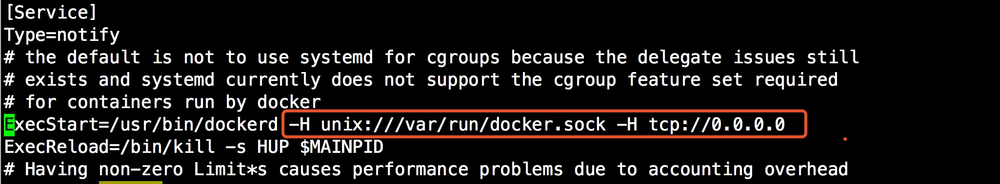

# Docker 安装部署
[Docker 官方安装文档](https://docs.docker.com/engine/installation/linux/docker-ce/centos/)
官方对 Centos 操作系统安装 Docker 的最低版本要求是 Centos7 的版本。
## 1、卸载老的版本

```shell
sudo yum remove docker \
                docker-common \
                docker-selinux \
                docker-engine
```
## 2、配置 YUM 仓库
安装依赖程序包

```shell
sudo yum install -y yum-utils \
  device-mapper-persistent-data \
  lvm2
```
添加官方 repo

```shell
sudo yum-config-manager \
    --add-repo \
    https://download.docker.com/linux/centos/docker-ce.repo
```
## 3、安装 Docker

```shell
sudo yum install docker-ce
```
## 4、启动 Docker

```shell
systemctl enable docker.serice
systemctl start docker.service
```
## 5、允许远程客户端请求本地 docker daemon
默认情况下，Docker daemon 只能响应本地 Host 上的客户端请求。如果要允许远程客户端请求，需要在配置文件中打开 TCP 监听，步骤如下：

1.编辑配置文件 

编辑配置文件  /etc/systemd/system/multi-user.target.wants/docker.service，在环境变量 ExecStart 后面添加 -H tcp://0.0.0.0，允许来自任意 IP 的客户端连接。


2.重启 Docker daemon

```shell
# systemctl daemon-reload
# systemctl restart daemon-reload 
如果是第一次启动这里的restart就换成start
```
3.客户端在命令行里加上 -H 参数指明远程 Docker 主机的地址，即可与远程服务器通信。


