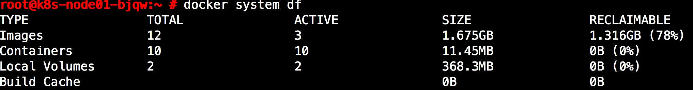

# Docker 导致系统根分区空间不足
## 故障描述

- 上午8点30分，运维团队收到微信报警，其中一台 docker host 报出根分区剩余空间不足 20%。根分区默认是50GB的空间。

## 故障分析

1. 怀疑是系统日志过大导致的空间不足，登录至服务器后执行 `du -sh /var/log/*` 排查是否有较大的日志文件。结果未发现较大的文件。
2. 执行 `du -sh /var/*` 以后发现 `/var/lib/`目录空间占用30GB左右。
3. 执行 `du -sh /var/lib/*` 发现 docker 目录占用的空间。

## 解决方法
### 1、docker system命令
docker system df命令，类似于Linux上的df命令，用于查看Docker的磁盘使用情况:



`docker system prune` 命令可以用于清理磁盘，删除关闭的容器、无用的数据卷和网络，以及dangling镜像(即无tag的镜像)。`docker system prune -a`命令清理得更加彻底，可以将没有容器使用Docker镜像都删掉。注意，这两个命令会把你暂时关闭的容器，以及暂时没有用到的Docker镜像都删掉了…所以使用之前一定要想清楚吶。

### 2、手动清理Docker镜像/容器/数据卷
对于旧版的Docker(版本1.13之前)，是没有docker system命令的，因此需要进行手动清理。这里给出几个常用的命令，删除所有关闭的容器

```bash
docker ps -a | grep Exit | cut -d ' ' -f 1 | xargs docker rm
```

删除所有dangling镜像(即无tag的镜像)：

```bash
docker rmi $(docker images | grep "^<none>" | awk "{print $3}")
```
删除所有dangling数据卷(即无用的volume)：


```bash
docker volume rm $(docker volume ls -qf dangling=true)
```
 
### 3、在/data 分区创建一个docker 目录软链接到/var/lib/docker
操作步骤 

停止docker 服务 

```bash
systemctl stop docker 
```

移动目录 

```bash
mv /var/lib/docker/ /data/ 
```

创建软连接符 

```bash
ln -sv /data/docker /var/lib/docker
```
启动 docker 服务 

```bash
systemctl start docker 
```

