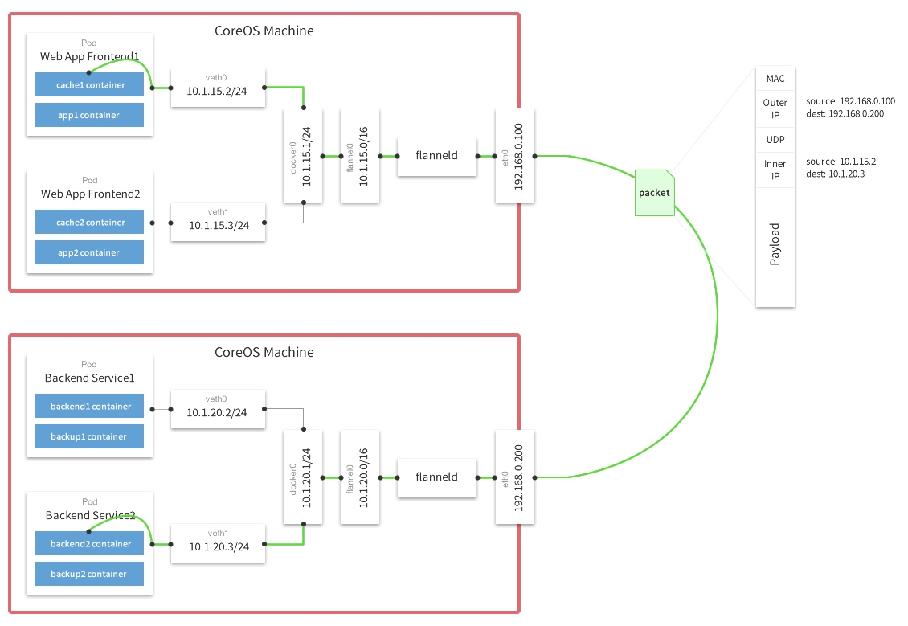

# Flannel 构建 Docker 网络
## Flannel介绍
Flannel 是 CoreOS 团队针对 Kubernetes 设计的一个网络规划服务，简单来说，它的功能是让集群中的不同节点主机创建的 Docker 容器都具有全集群唯一的虚拟 IP 地址。并且连通主机节点的网络。

但在默认的 Docker 配置中，每个节点上的 Docker服务会分别负责所在节点容器的IP分配。这样导致的一个问题是，不同节点上容器可能获得相同的内外 IP 地址。Flannel 的设计目的就是为集群中的所有节点重新规划IP地址的使用规则，从而使得不同节点上的容器能够获得「同属一个内网」且「不重复的」IP 地址，并让属于不同节点上的容器能够直接通过内网 IP通信。 默认的节点间数据通信方式是 UDP 转发。

下图来自网络：


简单的说flannel做了三件事情：

1. 数据从源容器中发出后，经由所在主机的docker0虚拟网卡转发到flannel0虚拟网卡，这是个P2P的虚拟网卡，flanneld服务监听在网卡的另外一端。 Flannel也是通过修改Node的路由表实现这个效果的。
2. 源主机的flanneld服务将原本的数据内容UDP封装后根据自己的路由表投递给目的节点的flanneld服务，数据到达以后被解包，然后直接进入目的节点的flannel0虚拟网卡，然后被转发到目的主机的docker0虚拟网卡，最后就像本机容器通信一样由docker0路由到达目标容器。
3. 使每个结点上的容器分配的地址不冲突。Flannel通过Etcd分配了每个节点可用的IP地址段后，再修改Docker的启动参数。“--bip=X.X.X.X/X”这个参数，它限制了所在节点容器获得的IP范围。

## Flannel 安装和使用
flannel 需要通过 etcd 管理每个节点分配的地址段。所以在安装 flannel之前应该先把 etcd 启动起来。

| IP地址 | 主机名 | 角色 |
| :-: | :-: | :-: |
| 10.100.4.211 | k8s-node01-bjqw.bd-yg.com | Node01 |
| 10.100.4.212 | k8s-node02-bjqw.bd-yg.com | Node02 |
| 10.100.4.214 | office-bjqw.bd-yg.com | Master |
#### 1.1 配置三台主机使用主机名解析

```shell
10.100.4.211 k8s-node01-bjqw.bd-yg.com etcd01
10.100.4.212 k8s-node02-bjqw.bd-yg.com etcd02
10.100.4.214 k8s-master-bjqw.bd-yg.com etcd03
```
#### 1.2 安装 flannel
三台主机上使用 yum 安装 flannel

```shell
root@k8s-node01-bjqw:~ # yum -y install flannel
```
#### 1.3 配置 flannel

```shell
root@k8s-node01-bjqw:~ # cat /etc/sysconfig/flanneld 
# Flanneld configuration options  

# etcd url location.  Point this to the server where etcd runs
# 三台节点只修改这一行配置，指明 etcd 节点的地址和端口
FLANNEL_ETCD_ENDPOINTS="http://etcd01:2379,http://etcd02:2379,http://etcd03:2379"

# etcd config key.  This is the configuration key that flannel queries
# For address range assignment
FLANNEL_ETCD_PREFIX="/atomic.io/network"
# 上面这行配置指明了etcd 中需要创建的 flannel 网络
# Any additional options that you want to pass
#FLANNEL_OPTIONS=""
```
#### 1.4 配置 etcd 中关于 flannel 的 key
Flannel 使用 Etcd 进行配置，来保证多个 Flannel 实例之间的配置一致性，所以需要在 etcd 上进行如下配置：（‘/atomic.io/network/config’这个 key 与上文 /etc/sysconfig/flanneld 中的配置项FLANNEL_ETCD_PREFIX 是相对应的，错误的话启动就会出错）

```shell
[root@master ~]# etcdctl mk /atomic.io/network/config '{"Network": "10.8.0.0/16"}'
                {"Network": "10.8.0.0/16"}
```
#### 1.5 启动 flannel 服务
在三台服务器上启动 flannel 服务

```shell
root@k8s-node01-bjqw:~ # systemctl enable flanneld.service
root@k8s-node01-bjqw:~ # systemctl start flanneld.service
```


