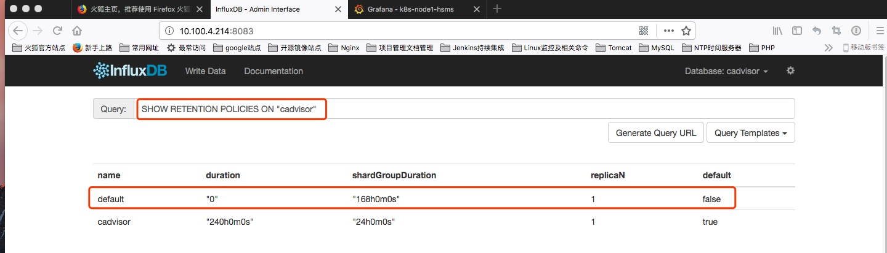

# InfluxDB 数据保存策略设置
### 数据保存策略（Retention Policies）
InfluxDB没有提供直接删除Points的方法，但是它提供了Retention Policies。
主要用于指定数据的保留时间：当数据超过了指定的时间之后，就会被删除。
### 查看当前数据库的 Retention Policies

```bash
SHOW RETENTION POLICIES ON "testDB"
```



可以看到，cadvisor 只有两个策略，各字段的含义如下：

name--名称，此示例名称为 default

duration--持续时间，0代表无限制

shardGroupDuration--> shardGroup的存储时间，shardGroup是InfluxDB的一个基本储存结构，应该大于这个时间的数据在查询效率上应该有所降低。

replicaN--全称是REPLICATION，副本个数

default--是否是默认策略

### 创建新的 Retention Policies

```bash
CREATE RETENTION POLICY "rp_name" ON "db_name" DURATION 30d REPLICATION 1 DEFAULT
```
**其中**：

1. rp_name：策略名
2. db_name：具体的数据库名
3. 30d：保存30天，30天之前的数据将被删除它具有各种时间参数，比如：h（小时），w（星期）
4. REPLICATION 1：副本个数，这里填1就可以了
5. DEFAULT 设为默认的策略

### 修改 Retention Policies

```bash
ALTER RETENTION POLICY "rp_name" ON db_name" DURATION 3w DEFAULT
```
### 删除Retention Policies

```bash
DROP RETENTION POLICY "rp_name" ON "db_name"
```
具体效果，大家可以直接自己在测试数据库上试验

